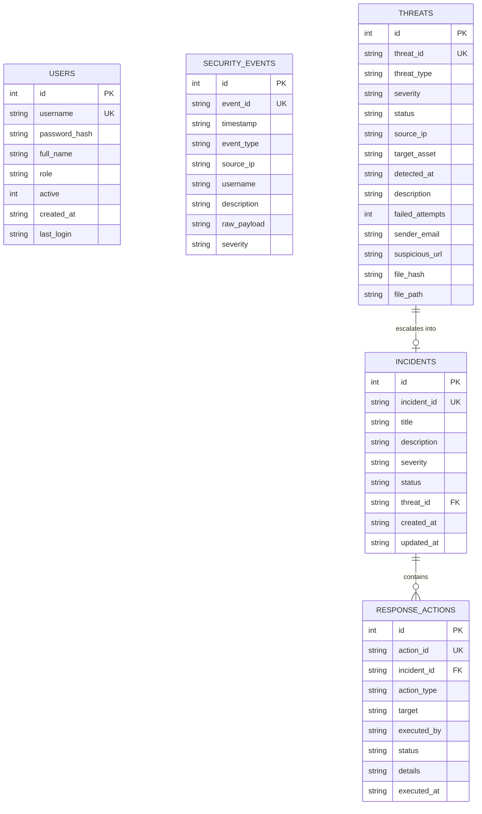

# CYBERSHIELD — Cybersecurity Threat Monitoring & Incident Response System

[](https://www.oracle.com/java/)
[](https://maven.apache.org/)
[](https://www.sqlite.org/)
[](https://docs.oracle.com/javase/tutorial/uiswing/)
[](#disclaimer)

> **Project Title:** CYBERSHIELD — Cybersecurity Threat Monitoring & Incident Response System  
> **Course:** Advanced Object-Oriented Programming (AOOP), Java  
> **Department:** Department of Computer Science & Engineering  
> **Team Size:** 3 Members (Lead: Parthab Sarkar)  
> **Evaluation Phase:** First Review (October 1st, 2026) — Java Swing GUI Front-End & Code Viva  
> **Configuration File:** Editable in GUI or via `data/project_team.properties`  
---

## ⚠️ Important Educational Simulation Disclaimer

> **DISCLAIMER:**  
> **CYBERSHIELD** is strictly an **educational simulation and incident-response desktop application**.  
> It models Security Operations Center (SOC) workflows and demonstrates core Java Object-Oriented Programming (AOOP) principles.  
> **No actual packet sniffing, exploit execution, malware execution, network interception, or offensive security attacks are performed.** All events and mitigation responses are simulated safe database and state changes.

---

## 1. Project Overview & Problem Statement

Modern enterprise Security Operations Centers (SOCs) continuously ingest thousands of security telemetry records per second to identify hostile intrusions, credential spraying, phishing campaigns, and malware infiltration.

Students learning **Advanced Object-Oriented Programming (AOOP)** often build generic management systems (library, bank, hospital) that fail to demonstrate the power of **polymorphic dispatch, class hierarchies, and event-driven architectures**.

**CYBERSHIELD** solves this by providing an easy-to-understand, reliable, offline-first cybersecurity SOC monitoring system. It demonstrates how telemetry events flow through a **polymorphic detection engine**, trigger **inherited threat models**, escalate into **composite incident cases**, and execute **containment response actions**—all persisted in a local SQLite database and visualized via a modern dark-themed Java Swing dashboard.

---

## 2. Key Features

- 📊 **Real-Time SOC Dashboard**: Live metric cards displaying total events, detected threats, high/critical alerts, open incidents, and resolved cases.
- 📡 **Telemetry Event Feed**: Ingests, filters, and searches simulated authentication, network, email, and process events with raw payload inspection.
- ⚡ **Rule-Based Polymorphic Threat Detection**:
  - **Brute Force Detection**: Evaluates sliding time-window authentication failures against threshold.
  - **Phishing Detection**: Analyzes deceptive keywords, spoofed senders, and malicious URL patterns.
  - **Malware Activity Detection**: Detects executable process creation, suspicious extensions, and simulated SHA-256 hash signatures.
  - **Suspicious Login Anomaly**: Detects impossible travel geographic anomalies and atypical off-hours access.
- 🚨 **Incident Response Console**: 1-click threat escalation into formal cases with containment actions:
  - *Block IP* (simulated perimeter firewall block)
  - *Disable User* (simulated credential lockout)
  - *Quarantine Simulation* (simulated endpoint host isolation)
  - *Mark for Review* (simulated analyst triage queue)
- 🎯 **Interactive Attack Scenario Simulator**: Triggers live demonstrations of all 4 attack categories with real-time console execution traces.
- 📈 **Analytics & Audit Trail**: Visual category breakdowns, severity distributions, and incident response history logs.
- 👥 **Role-Based User Management**: Role separation (`ADMIN` vs `ANALYST`) with SHA-256 password hashing.

---

## 3. Technology Stack

- **Programming Language:** Java 17 (Source & Target compatibility)
- **Build & Dependency Tool:** Apache Maven
- **Graphical User Interface:** Java Swing (Pure native, dark SOC cybersecurity palette)
- **Local Database:** SQLite 3 via official Xerial SQLite JDBC Driver (`3.45.2.0`)
- **Logging / Testing:** SLF4J NOP, JUnit 5 Jupiter for automated smoke testing
- **Architecture:** Layered Architecture (`model`, `service`, `repository`, `ui`, `util`, `exception`)
- **Offline-First:** Zero external cloud APIs, zero web frameworks, runs completely offline on standard student laptops.

---

## 4. Object-Oriented Programming (AOOP) Principles Demonstrated

| Concept | Implementation in CYBERSHIELD | Viva Talking Point |
| :--- | :--- | :--- |
| **Encapsulation** | All entity fields (`User`, `SecurityEvent`, `Threat`, `Incident`) are `private`. Controlled access via getters, setters with validation, and `Collections.unmodifiableList()`. | Protects internal entity state from unauthorized direct modification. |
| **Abstraction** | `abstract class Threat` defines common contract (`evaluateSeverity()`, `generateIncidentReport()`, `getRecommendedAction()`). `interface ThreatDetector` specifies detection contract (`canDetect()`, `detect()`). | Separates interface contracts from concrete attack mechanisms. |
| **Inheritance** | Base class `Threat` extended by `BruteForceThreat`, `PhishingThreat`, `MalwareThreat`, and `SuspiciousLoginThreat`. | Reuses shared attributes (`threatId`, `sourceIp`, `detectedAt`) while adding specialized fields. |
| **Polymorphism** | `ThreatDetectionEngine` iterates over `List<ThreatDetector>` and invokes `detect()` polymorphically. Calls to `threat.generateIncidentReport()` dynamically render specific dossiers. | Runtime polymorphic method dispatch without `instanceof` cascades in business logic. |
| **Composition** | `Incident` **HAS-A** `Threat` (`associatedThreat`), and **HAS-MANY** `ResponseAction`s (`List<ResponseAction>`). `ThreatDetectionEngine` **HAS-MANY** `ThreatDetector`s. | Models real-world "has-a" relationships more flexibly than deep inheritance. |
| **Exception Handling** | Custom checked hierarchy: `CyberShieldException` $\to$ `DatabaseOperationException`, `AuthenticationException`, `ThreatDetectionException`, `IncidentManagementException`. | Clear domain-specific error reporting with friendly Swing dialogs without raw stack trace leaks. |
| **Collections** | `ArrayList` (log streams, detector registries), `HashMap` (in-memory attempt counters per user/IP), `EnumMap` (analytics aggregations). | Demonstrates efficient data structuring for in-memory security heuristics. |

---

## 5. Layered Architecture

```
src/main/java/com/cybershield/
├── Main.java                        # System bootstrap, L&F, DB init & login trigger
├── model/                           # Domain entities with Encapsulation & Inheritance
│   ├── User.java                    # Operator account model
│   ├── SecurityEvent.java           # Raw security telemetry data model
│   ├── Threat.java                  # Abstract base class (Abstraction)
│   ├── BruteForceThreat.java        # Specialized Threat subclass
│   ├── PhishingThreat.java          # Specialized Threat subclass
│   ├── MalwareThreat.java           # Specialized Threat subclass
│   ├── SuspiciousLoginThreat.java   # Specialized Threat subclass
│   ├── Incident.java                # Case entity (Composition)
│   ├── ResponseAction.java          # Containment audit entity
│   └── enums/                       # Strongly typed enums
│       ├── Severity.java            # LOW, MEDIUM, HIGH, CRITICAL
│       ├── EventType.java           # AUTH_FAILURE, SUSPICIOUS_EMAIL, etc.
│       ├── ThreatType.java          # BRUTE_FORCE, PHISHING, MALWARE, etc.
│       ├── ThreatStatus.java        # NEW, INVESTIGATING, RESOLVED, FALSE_POSITIVE
│       ├── IncidentStatus.java      # OPEN, INVESTIGATING, RESOLVED, CLOSED
│       ├── ResponseActionType.java  # BLOCK_IP, DISABLE_USER, QUARANTINE_SIMULATION
│       └── UserRole.java            # ADMIN, ANALYST
├── service/                         # Business & heuristic processing
│   ├── AuthService.java             # Credential validation & session management
│   ├── ThreatDetectionEngine.java   # Polymorphic detector orchestrator
│   ├── IncidentService.java         # Case escalation & response action execution
│   ├── SimulationService.java       # Mock telemetry generators for live demo
│   └── detector/                    # Polymorphic detector implementations
│       ├── ThreatDetector.java      # Interface (Abstraction)
│       ├── BruteForceDetector.java  # Implements ThreatDetector
│       ├── PhishingDetector.java    # Implements ThreatDetector
│       ├── MalwareDetector.java     # Implements ThreatDetector
│       └── SuspiciousLoginDetector.java
├── repository/                      # Data Access Layer using JDBC & SQLite
│   ├── DatabaseManager.java         # SQLite connection, schema init & seed data
│   ├── UserRepository.java          # User CRUD operations
│   ├── SecurityEventRepository.java # Batch & paginated event persistence
│   ├── ThreatRepository.java        # Polymorphic threat persistence & factory mapping
│   ├── IncidentRepository.java      # Composed incident case persistence
│   └── ResponseActionRepository.java# Response action audit persistence
├── exception/                       # Custom exception hierarchy
│   ├── CyberShieldException.java    # Base checked exception
│   ├── DatabaseOperationException.java
│   ├── AuthenticationException.java
│   ├── ThreatDetectionException.java
│   └── IncidentManagementException.java
├── util/                            # Helper utilities
│   ├── SecurityUtils.java           # SHA-256 password hashing & UUID generation
│   ├── DateTimeUtils.java           # Timestamp formatting helpers
│   ├── ValidationUtils.java         # IP, email, username validations
│   └── SimulationDataGenerator.java # Predefined mock attack scenarios
└── ui/                              # Java Swing Desktop Interface
    ├── CyberTheme.java              # Dark SOC color palette & font constants
    ├── LoginDialog.java             # Analyst login window
    ├── MainDashboardFrame.java      # Main navigation frame & metric counters
    ├── components/                  # Custom UI widgets
    │   ├── MetricCard.java          # Metric summary card
    │   ├── StyledButton.java        # Cyberpunk glow buttons
    │   └── CyberTable.java          # Dark themed JTable with severity badges
    └── panels/                      # Tabbed functional views
        ├── TelemetryPanel.java      # Live event monitor & raw payload inspection
        ├── ThreatMonitorPanel.java  # Identified threats & polymorphic dossier
        ├── IncidentConsolePanel.java# Containment actions & action history
        ├── AttackSimulatorPanel.java# 1-click attack simulation triggers
        ├── AnalyticsPanel.java      # Visual metrics & response audit logs
        └── UsersPanel.java          # User administration (Role restricted)
```

---

## 6. SQLite Relational Database Schema

The SQLite database file is automatically created at `data/cybershield.db` upon initial launch.



---

## 7. Demonstration Credentials

On startup, default accounts are seeded automatically if the database is fresh:

| Username | Password | Role | Description |
| :--- | :--- | :--- | :--- |
| **`analyst`** | **`cyber123`** | `ANALYST` | Standard SOC Operator: monitor events, inspect threats, dispatch response actions. |
| **`admin`** | **`admin123`** | `ADMIN` | Security Administrator: full control including User Management. |

---

## 8. Installation & Running Instructions

### Prerequisites
- **JDK 17** or higher installed (`java -version`, `javac -version`)
- **Apache Maven 3.8+** (or use the included portable Maven)

### Option 1: One-Click Execution (Windows Batch)
Double-click or run from command prompt:
```cmd
run.bat
```

### Option 2: PowerShell Runner
```powershell
.\run.ps1
```

### Option 3: Standard Maven Commands
```bash
# 1. Compile all source code
mvn clean compile

# 2. Run automated test suite
mvn test

# 3. Package executable standalone JAR
mvn package

# 4. Launch the application
java -jar target/cybershield-1.0.0.jar
# OR directly via Maven
mvn exec:java
```

---

## 9. Finalized 3-Member Team Division & First Review Dossier (Oct 1st)

> 💡 **In-App Team Configuration:** Team details and project title can be viewed and edited live in the running application by clicking **"🎓 Review 1 Team Dossier"** on the top toolbar or menu bar. Edits are persisted automatically to `data/project_team.properties`.

| Team Member | Details & Subsystem Responsibility | Key Classes & Deliverables | Viva Code Focus Areas |
| :--- | :--- | :--- | :--- |
| **Member 1 (Team Lead)**<br>**Parthab Sarkar** | **Roll No:** `23BCSE0101` *(Editable)*<br>**Subsystem:** Database Layer, Relational Schema & Core Framework | `DatabaseManager`, `UserRepository`, `SecurityEventRepository`, `ThreatRepository`, `IncidentRepository`, `ResponseActionRepository`, `ProjectMetadata`, custom checked exception hierarchy. | JDBC connection lifecycle, PreparedStatement, SQL injection prevention, SQLite transactions, try-with-resources, custom checked exceptions. |
| **Member 2**<br>**Team Member 2** | **Roll No:** `23BCSE0102` *(Editable)*<br>**Subsystem:** Threat Hierarchy, Polymorphic Heuristic Engine & Attack Simulator | `Threat` abstract class, `BruteForceThreat`, `PhishingThreat`, `MalwareThreat`, `SuspiciousLoginThreat`, `ThreatDetector` interface, concrete detectors, `ThreatDetectionEngine`, `SimulationService`. | Abstraction vs Inheritance, Runtime Polymorphism, Strategy pattern, in-memory sliding window counters with Collections (`Map`, `List`). |
| **Member 3**<br>**Team Member 3** | **Roll No:** `23BCSE0103` *(Editable)*<br>**Subsystem:** Java Swing Front-End Architecture, Component Suite & Incident Workflows | `MainDashboardFrame`, `ProjectTeamDialog`, `MitreAssetTreePanel`, `BlockedIpsListPanel`, `LoginDialog`, `MetricCard`, `CyberTable`, all UI panels (`Telemetry`, `Threats`, `Incidents`, `Simulator`, `Analytics`, `Users`), `IncidentService`. | Swing Event Dispatch Thread (EDT), 35+ Swing components integration, Composition (`Incident` HAS-A `Threat` & HAS-MANY `ResponseAction`), responsive event wiring, containment state machines. |

---

## 9.1 Complete Java Swing Front-End Component Audit (35 Items Implemented)

*Criterion 1 for Review 1: Marks awarded based on how many components were added in the GUI (almost all Java Swing components).*

| # | Swing Component | Class Name | Usage & Role in CYBERSHIELD | Source Location |
| :---: | :--- | :--- | :--- | :--- |
| **1** | `JFrame` | `javax.swing.JFrame` | Main application SOC desktop frame with custom dark title bar and layout | `MainDashboardFrame.java` |
| **2** | `JDialog` | `javax.swing.JDialog` | Modal dialogs for Analyst Login and Team/Review 1 Dossier | `LoginDialog.java`, `ProjectTeamDialog.java` |
| **3** | `JPanel` | `javax.swing.JPanel` | Modular container panels with custom dark theme backgrounds and borders | Across all views |
| **4** | `JLabel` | `javax.swing.JLabel` | Metrics values, titles, status badges, and dynamic text counters | `MetricCard.java`, headers |
| **5** | `JButton` | `javax.swing.JButton` | Action buttons with cyberpunk glow hover effects and status styling | `StyledButton.java` |
| **6** | `JToggleButton` | `javax.swing.JToggleButton` | Real-time Telemetry Live Stream toggle ON/OFF | `MainDashboardFrame.java` (Toolbar) |
| **7** | `JCheckBox` | `javax.swing.JCheckBox` | Auto-escalate, audio chime alert, and filter check controls | `AttackSimulatorPanel.java`, `TelemetryPanel.java` |
| **8** | `JRadioButton` | `javax.swing.JRadioButton` | Threat severity filters and simulation profile selectors | `ThreatMonitorPanel.java`, `AttackSimulatorPanel.java` |
| **9** | `ButtonGroup` | `javax.swing.ButtonGroup` | Enforces mutual exclusion for severity and simulation profile radio buttons | `ThreatMonitorPanel.java`, `AttackSimulatorPanel.java` |
| **10** | `JComboBox` | `javax.swing.JComboBox` | Dropdowns for telemetry event types, user roles, and export options | `TelemetryPanel.java`, `UsersPanel.java` |
| **11** | `JTextField` | `javax.swing.JTextField` | Search query input, manual IP address entry, and profile editing | `TelemetryPanel.java`, `LoginDialog.java`, `ProjectTeamDialog.java` |
| **12** | `JPasswordField` | `javax.swing.JPasswordField` | Masked credential inputs with secure SHA-256 password hashing | `LoginDialog.java`, `UsersPanel.java` |
| **13** | `JTextArea` | `javax.swing.JTextArea` | Monospace raw payload inspection and simulation execution traces | `TelemetryPanel.java`, `AttackSimulatorPanel.java` |
| **14** | `JTextPane` | `javax.swing.JTextPane` | Rich HTML formatted polymorphic threat dossiers with colored status badges | `ThreatMonitorPanel.java` |
| **15** | `JTable` | `javax.swing.JTable` | Custom styled tables with severity badge renderers and column sorters | `CyberTable.java` (All Panels) |
| **16** | `JScrollPane` | `javax.swing.JScrollPane` | Dark-themed scrollable viewports for tables, text areas, and trees | `CyberTable.java`, Panels |
| **17** | `JSplitPane` | `javax.swing.JSplitPane` | Master-detail resizable horizontal and vertical divider panes | `ThreatMonitorPanel.java`, `IncidentConsolePanel.java`, `TelemetryPanel.java` |
| **18** | `JTabbedPane` | `javax.swing.JTabbedPane` | Multi-tab organized navigation across metrics, dossiers, and checklists | `AnalyticsPanel.java`, `ThreatMonitorPanel.java`, `ProjectTeamDialog.java` |
| **19** | `JProgressBar` | `javax.swing.JProgressBar` | Threat breakdown category progress meters and real-time attack progress animation | `AnalyticsPanel.java`, `AttackSimulatorPanel.java` |
| **20** | `JSlider` | `javax.swing.JSlider` | Detection Sensitivity threshold (0-100%) and simulation pacing sliders | `MainDashboardFrame.java`, `ThreatMonitorPanel.java`, `AttackSimulatorPanel.java` |
| **21** | `JSpinner` | `javax.swing.JSpinner` | Numeric spinners for auto-refresh interval (1-60s) and log limit (10-500) | `MainDashboardFrame.java`, `TelemetryPanel.java` |
| **22** | `JList` | `javax.swing.JList` | Active firewall perimeter blocked IP droplist with add/remove controls | `BlockedIpsListPanel.java` |
| **23** | `JTree` | `javax.swing.JTree` | Enterprise IT Infrastructure Assets and MITRE ATT&CK Matrix tree hierarchy | `MitreAssetTreePanel.java` |
| **24** | `JMenuBar` | `javax.swing.JMenuBar` | Top desktop application menu bar (File, View, Simulation, Tools, Review) | `MainDashboardFrame.java` |
| **25** | `JMenu` | `javax.swing.JMenu` | Dropdown menus with styled font and accelerator shortcuts | `MainDashboardFrame.java` |
| **26** | `JMenuItem` | `javax.swing.JMenuItem` | Menu actions for exporting, launching scenarios, and switching views | `MainDashboardFrame.java` |
| **27** | `JCheckBoxMenuItem` | `javax.swing.JCheckBoxMenuItem` | Checkable menu items for Auto-Refresh timer toggle | `MainDashboardFrame.java` |
| **28** | `JRadioButtonMenuItem` | `javax.swing.JRadioButtonMenuItem` | Radio menu items for selecting execution profiles (Standard / Aggressive) | `MainDashboardFrame.java` |
| **29** | `JPopupMenu` | `javax.swing.JPopupMenu` | Right-click context menus on table rows (Escalate, Copy IP, Block, Inspect) | `ThreatMonitorPanel.java`, `TelemetryPanel.java` |
| **30** | `JToolBar` | `javax.swing.JToolBar` | SOC Rapid Action operations toolbar beneath header | `MainDashboardFrame.java` |
| **31** | `JFileChooser` | `javax.swing.JFileChooser` | Native OS file chooser dialog for exporting incident cases and telemetry to CSV | `MainDashboardFrame.java`, `TelemetryPanel.java` |
| **32** | `JColorChooser` | `javax.swing.JColorChooser` | Live interactive SOC accent color customizer dialog | `MainDashboardFrame.java` |
| **33** | `JSeparator` | `javax.swing.JSeparator` | Visual horizontal and vertical separators in toolbars, menus, and forms | `MainDashboardFrame.java`, dialogs |
| **34** | `JToolTip` | `javax.swing.JToolTip` | Contextual hover tooltips on all interactive buttons and inputs | Across all UI controls |
| **35** | `JOptionPane` | `javax.swing.JOptionPane` | Modal alert, confirmation, input, and warning message popups | Controllers & service handlers |

---

## 10. Main Demo Story (Step-by-Step Viva Demo)

1. **Launch & Login**: Open app, login as `analyst` with `cyber123`.
2. **Dashboard Overview**: Show initial metric counters and seeded background events.
3. **Trigger Attack Simulator**: Open *Attack Simulator*, select **"SIMULATE BRUTE FORCE"**.
4. **Inspect Telemetry**: Switch to *Telemetry Panel* to observe 6 rapid failed SSH authentication logs.
5. **Inspect Detected Threat**: Switch to *Threat Monitor* to see `THR-BF-XXXX` (HIGH Severity). Highlight the polymorphic investigative dossier.
6. **Escalate to Incident**: Click **"▲ Escalate to Incident"**.
7. **Contain Incident**: Switch to *Incidents Panel*, select the case, click **"🛡 Block IP"**. Show response action recorded in the audit log.
8. **Resolve Case**: Click **"✓ Resolve Incident"**, enter resolution note.
9. **Verify Metrics & Persistence**: Switch to *Analytics* and *Dashboard* to confirm updated metrics and restart the app to verify SQLite persistence.

---

## 11. Screenshots Section Placeholder

> *Place application screenshots in this section for college report submission:*
> - `docs/screenshots/01_login_dialog.png` — Analyst Authentication Dialog
> - `docs/screenshots/02_main_dashboard.png` — SOC Operations Dashboard with Metric Cards
> - `docs/screenshots/03_attack_simulator.png` — Attack Scenario Simulation Runner
> - `docs/screenshots/04_threat_monitor.png` — Polymorphic Threat Dossier View
> - `docs/screenshots/05_incident_console.png` — Incident Containment Actions and Action History
> - `docs/screenshots/06_analytics_panel.png` — Severity Breakdowns & Audit Trail

---

## 12. Limitations & Future Scope

### Educational Limitations
- Uses simulated telemetry rather than live raw network packet drivers (WinPcap/libpcap).
- Response actions (e.g. Block IP) modify application state and audit tables rather than manipulating actual OS host firewalls.
- Designed as an offline single-host desktop application without multi-node clustering.

### Future Scope
- Integration with standard Syslog (RFC 5424) socket listeners for external simulated device logs.
- Exporting incident post-mortem reports to PDF / CSV formats.
- Implementation of MITRE ATT&CK matrix tagging for identified threats.
